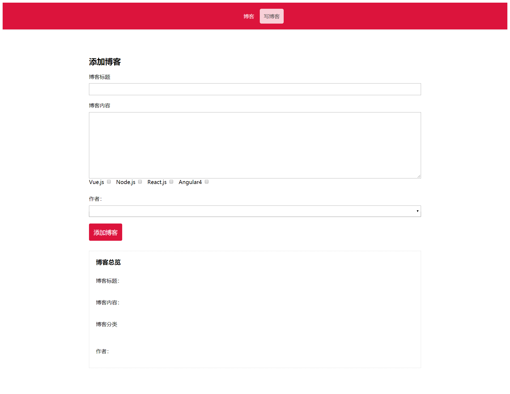

# 前言
这个项目是去年十二月写的，是我的第一个vue项目，当时看了[米斯特吴老师](http://oceanwu.ke.qq.com/)的入门教程。这里十分推荐米斯特吴老师的[vue入门教程](https://ke.qq.com/course/279700?taid=1982054392939668)。这是一个很简单的使用vue开发的demo，也是吴老师教学课程中的一个项目。由于自己刚接触前端，在当时也是花了很多时间去学习。我个人认为这是一个不错的练手项目，在接触vue之前，我对组件化开发和前后端分离一直都是半知半解。这个项目虽然简单，但是知识点十分丰富。涵盖vue、vue-router、vue-cli2、axios等。并使用了野狗云作为后端数据来源，不过由于[野狗云](https://www.wilddog.com/dashboard)现在需要收费而转为[firebase](https://firebase.google.cn/)（需要翻墙）。总的来说，这是一个十分基础的vue前后端分离项目。
## 技术栈
***
vue2.x + vue-cli2.x + vue-router + axios + es6 + 野狗云  
***
## 项目运行
### 由于项目使用vue-cli脚手架搭建，因此需要安装node.js环境，安装方法自行百度
```
//首先使用git克隆项目到本地
git clone git@github.com:leewayjean/vue-blog.git
//安装依赖
npm install/cnpm install 
//运行项目
npm run dev
```
***
## 项目功能  
项目实现了简单的CURD  

    * 添加博客
    * 删除博客
    * 编辑博客
    * 展示单条博客
## 项目截图  
    

## 项目布局
```
.
├── build                                       // webpack配置文件
├── config                                      // 项目打包路径
├── node_modules                                // 项目模块依赖
├── src                                         // 源码目录
│   ├── components                              // 组件
│   │     ├── AddBlog.vue                       // 添加博客组件
│   │     ├── BlogHeader.vue                    //博客头部组件
│   │     ├── EditBlog.vue                      //编辑博客组件
│   │     ├── ShowBlog.vue                      // 博客列表
│   │     ├── SingleBlog.vue                    //博客详情
│   ├── config                                  // 基本配置
│   ├── App.vue                                 // 页面入口文件
│   ├── main.js                                 // 程序入口文件，加载各种公共组件
│   ├── routers.js                              // 路由
├── static                                      //资源目录
├── index.html                                  //入口html文件
```
## 总结
上传这个项目一方面是记录自己的学习过程，另一方面是练习新学习的markdown语法和git的使用。该项目目前因为野狗云没有续费的原因，已经不能实现以上所说的功能。可以将数据接口替换成自己的firebase，两者差别不大。